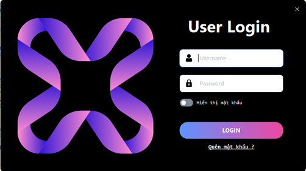
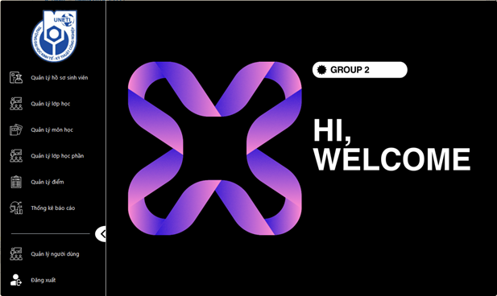
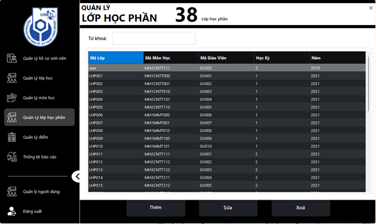
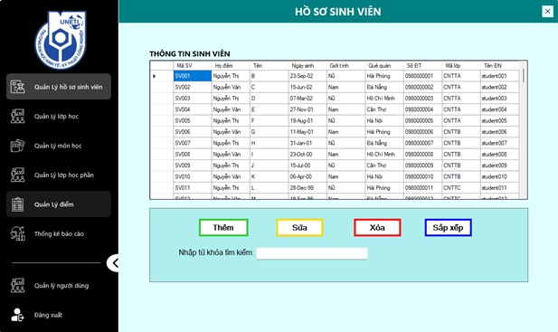
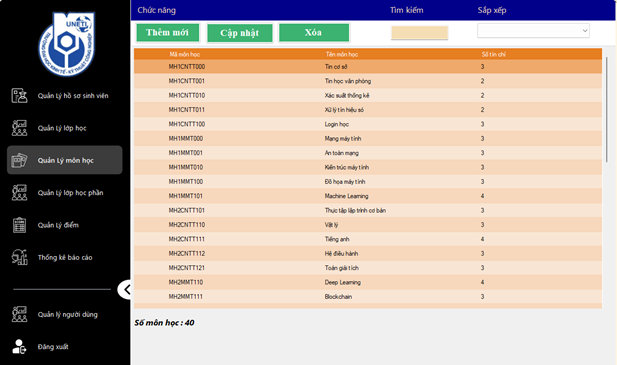
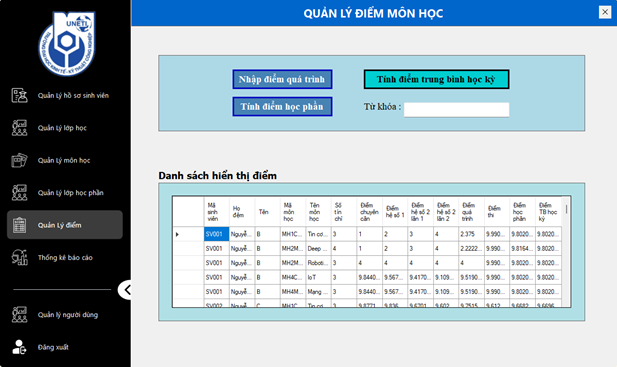
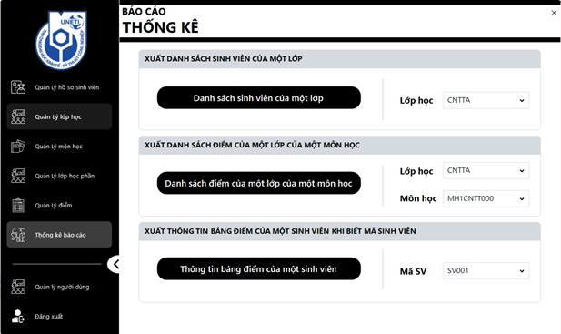

# 🎓 Hệ thống Quản lý Sinh viên (Student Management System)


> Ứng dụng Desktop quản lý đào tạo đại học toàn diện được xây dựng bằng **C# (WinForms)** và **Entity Framework Core**, sở hữu giao diện hiện đại và kiến trúc hệ thống vững chắc.

## 📖 Giới thiệu Dự án

Dự án này là một Hệ thống Quản lý Sinh viên được thiết kế để hỗ trợ các cơ sở giáo dục quản lý hồ sơ sinh viên, đăng ký học phần và quản lý điểm số một cách hiệu quả.

**Điểm Nổi Bật (Key Highlight):**
Ban đầu, dự án sử dụng công nghệ cũ ADO.NET với các câu lệnh SQL thuần. Tôi đã thực hiện **tái cấu trúc (refactoring)** thành công toàn bộ tầng truy cập dữ liệu sang **Entity Framework Core**, đồng thời áp dụng **Kiến trúc 3 lớp (3-Layer Architecture)** sạch sẽ (Giao diện - Nghiệp vụ - Dữ liệu). Việc này giúp code dễ bảo trì, tăng hiệu suất xử lý và nâng cao tính bảo mật.

### 📸 Ảnh chụp màn hình (Screenshots)

*(Vui lòng thêm ảnh chụp màn hình dự án của bạn vào thư mục images và cập nhật đường dẫn bên dưới)*

| Màn hình Đăng nhập | Trang chủ |
|:---:|:---:|
|  |  |

| Quản lý Lớp học phần | Quản lý Sinh viên |
|:---:|:---:|
|  |  |

| Quản lý Môn học | Quản lý Điểm |
|:---:|:---:|
|  |  |

<div align="center">
  <strong>Báo Cáo Thống Kê</strong>
  <br>
  <br>
  
</div>

## 🚀 Tính năng Chính

* **Quản lý Sinh viên & Học phần:** Các thao tác CRUD (Thêm, Sửa, Xóa, Xem) cho sinh viên, giảng viên, lớp học và môn học.
* **Quản lý Điểm số:** Nhập điểm thành phần (Chuyên cần, Giữa kỳ, Cuối kỳ) và **tự động tính điểm trung bình (GPA)** tích lũy.
* **Tìm kiếm Nâng cao:** Lọc và tìm kiếm dữ liệu tốc độ cao sử dụng truy vấn **LINQ**.
* **Báo cáo & Thống kê:** Xuất các báo cáo thống kê (Bảng điểm, Danh sách lớp) ra định dạng **Excel** (sử dụng EPPlus) và **PDF** (sử dụng ReportViewer).
* **Bảo mật:** Hệ thống phân quyền (Admin/User) với mật khẩu được mã hóa an toàn bằng thuật toán **BCrypt**.
* **Giao diện Hiện đại:** Tối ưu trải nghiệm người dùng (UI/UX) với bộ công cụ **Guna UI**.

## 🛠 Công nghệ Sử dụng

* **Ngôn ngữ:** C# (.NET Framework)
* **Giao diện:** Windows Forms (WinForms), Guna UI
* **Cơ sở dữ liệu:** Microsoft SQL Server
* **ORM:** Entity Framework Core (Database First approach)
* **Thư viện hỗ trợ:**
    * `BCrypt.Net`: Mã hóa mật khẩu.
    * `EPPlus`: Xuất dữ liệu ra Excel.
    * `Microsoft.Reporting.WinForms`: Tạo báo cáo PDF.

## 🏗 Kiến trúc Hệ thống

Giải pháp được tổ chức theo mô hình **Kiến trúc 3 lớp (3-Layer Architecture)**:

1.  **Presentation Layer (Views):** Các Form WinForms sử dụng Guna UI. Xử lý tương tác người dùng và gọi xuống tầng Services.
2.  **Service Layer (Services):** Chứa toàn bộ logic nghiệp vụ (ví dụ: `TinhDiemTBHK`, `AuthService`, `SinhVienService`). Đóng vai trò cầu nối giữa UI và Data.
3.  **Data Access Layer (Models):** Chứa DbContext và các Model của Entity Framework Core được ánh xạ từ cơ sở dữ liệu.

## ⚙️ Cài đặt & Hướng dẫn chạy

1.  **Clone dự án:**
    ```bash
    git clone [https://github.com/your-username/student-management-system.git](https://github.com/your-username/student-management-system.git)
    ```
2.  **Cài đặt Cơ sở dữ liệu:**
    * Mở SQL Server Management Studio (SSMS).
    * Chạy script `Database/Script.sql` (nếu có) hoặc Attach file `.mdf` vào SQL Server.
    * Cập nhật chuỗi kết nối (**Connection String**) trong file `App.config` hoặc `MyDbContext.cs`:
    ```csharp
    "Data Source=TEN_SERVER_CUA_BAN;Initial Catalog=QUANLYSINHVIEN;Integrated Security=True;TrustServerCertificate=True"
    ```
3.  **Build & Chạy:**
    * Mở solution bằng **Visual Studio 2022**.
    * Chọn chuột phải vào Solution -> **Restore NuGet Packages**.
    * Nhấn **F5** để chạy ứng dụng.

## 👤 Tác giả

**Hà Gia Kiệt**
* **Vai trò:** Lập trình viên Backend & Ứng dụng Desktop
* **Học vấn:** Kỹ sư Công nghệ thông tin (GPA 3.38)
* **Kỹ năng:** C# (.NET Core/Framework, ASP.NET Core, LINQ, ADO.NET), Entity Framework Core (EF Core).

---
*Nếu bạn thấy dự án này hữu ích, hãy tặng mình 1 sao (star) nhé! ⭐️*
